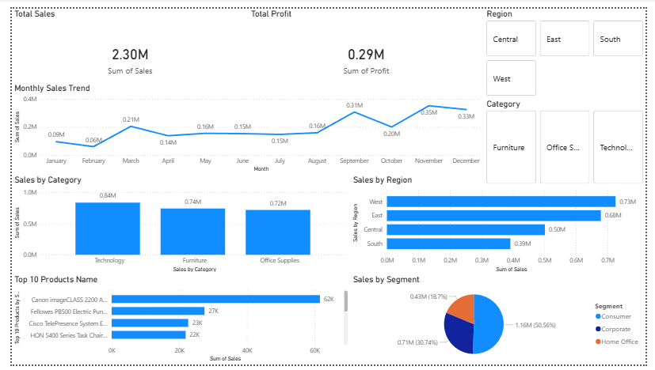

# E-commerce Sales Analytics Dashboard

This project analyzes retail sales data to uncover trends in product performance, regional sales, and customer segments.

## Power BI Dashboard Preview

## Project Description

This project focuses on analyzing retail sales data to uncover insights about product performance, customer behavior, and regional sales trends. The analysis was performed using Python for data exploration and Power BI for building an interactive business dashboard.

The dataset contains transaction-level information including order dates, product categories, customer segments, regions, sales, and profit. Using this data, multiple analytical techniques were applied to understand sales performance, identify high-value customers, and discover patterns in purchasing behavior.

The Python analysis includes exploratory data analysis (EDA), RFM customer segmentation, cohort retention analysis, sales forecasting, and market basket analysis. These techniques help identify important business patterns such as repeat customer behavior, product associations, and seasonal demand trends.

The insights derived from the analysis were visualized in an interactive Power BI dashboard. The dashboard provides key metrics such as total sales, total profit, monthly sales trends, category-wise sales performance, regional sales distribution, and the top revenue-generating products.

This project demonstrates the end-to-end workflow of a data analytics project, from data cleaning and exploration to advanced analysis and business-focused visualization.

## Tools Used
- Python (Pandas, Matplotlib, Seaborn)
- Power BI
- Jupyter Notebook

## Project Workflow
1. Data cleaning and preprocessing using Python (Pandas)
2. Exploratory data analysis to identify sales trends
3. Customer behavior analysis using RFM segmentation
4. Cohort retention analysis to study customer lifecycle
5. Market basket analysis to identify product combinations
6. Sales forecasting using time-series analysis
7. Interactive Power BI dashboard for business insightsv

## Key Insights
- Technology category generated the highest revenue among all product categories.
- The West region contributed the largest share of total sales.
- Sales trends show increased demand during the final quarter of the year.
- A small set of products contributes a significant portion of total revenue (Pareto principle).

## Analysis Performed
- Exploratory Data Analysis (EDA)
- RFM Customer Segmentation
- Cohort Retention Analysis
- Sales Forecasting
- Market Basket Analysis

## Dashboard Insights
The Power BI dashboard highlights:
- Total sales and profit KPIs
- Monthly sales trends
- Category performance
- Regional sales distribution
- Top 10 revenue-generating products

## Project Files
- `notebooks/sales_analysis.ipynb` – Python analysis
- `dashboard/Ecommerce_Sales_Dashboard.pbix` – Power BI dashboard
- `data/Sample - Superstore.xls` – Dataset
